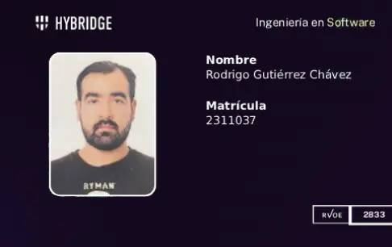

Hola Mundo Yo soy Rorry!

Soy Estudiante de Ingenieria en Software @ Hybridge Education

https://hybridge.education/

---

## 🛠 Herramientas

**Languajes de Programaciòn**

- Python
- JavaScript

**Frontend**
- HTML
- CSS
- React
- Tailwindcss

**Backend**
- Node.js
- Express.js
- PostgreSQL

**Herramientas**
- Git & GitHub
- Linux
- N8N
- Supabase
  
**Especialidades**
- Fullstack Devops
- Analisis y Procesamiento de Datos

---
.. ¿Y si El còdigo pudiera ser utilizado no solamente para crear software, sino tambièn para expandir la **consciencia**?

---

## 📫 Contacto

- Correo: rodrigogtzchavez@gmail.com
- Website: https://rodrigogtzchavez.github.io/OnlinePortfolio/
- YouTube: https://www.youtube.com/@LeonAzurielRodrigo

---

⭐ *Gracias por visitar mi perfil de Github*

<!--
**RodrigoGtzChavez/RodrigoGtzChavez** is a ✨ _special_ ✨ repository because its `README.md` (this file) appears on your GitHub profile.

Here are some ideas to get you started:

-  I’m currently working on ...
- 🌱 I’m currently learning ...
- 👯 I’m looking to collaborate on ...
- 🤔 I’m looking for help with ...
- 💬 Ask me about ...
- 📫 How to reach me: ...
- 😄 Pronouns: ...
- ⚡ Fun fact: ...
-->
